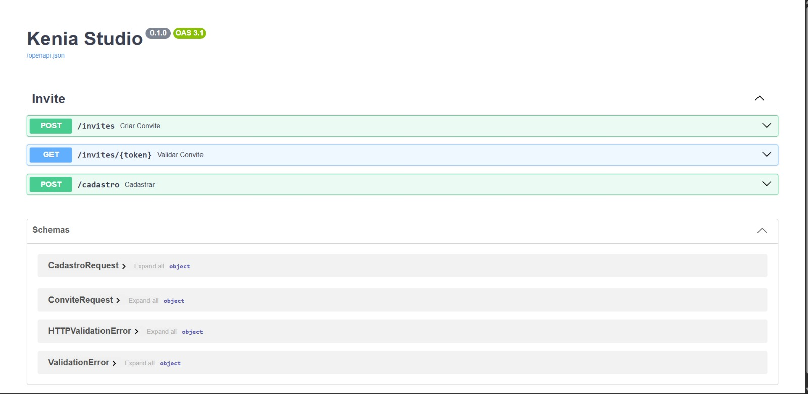
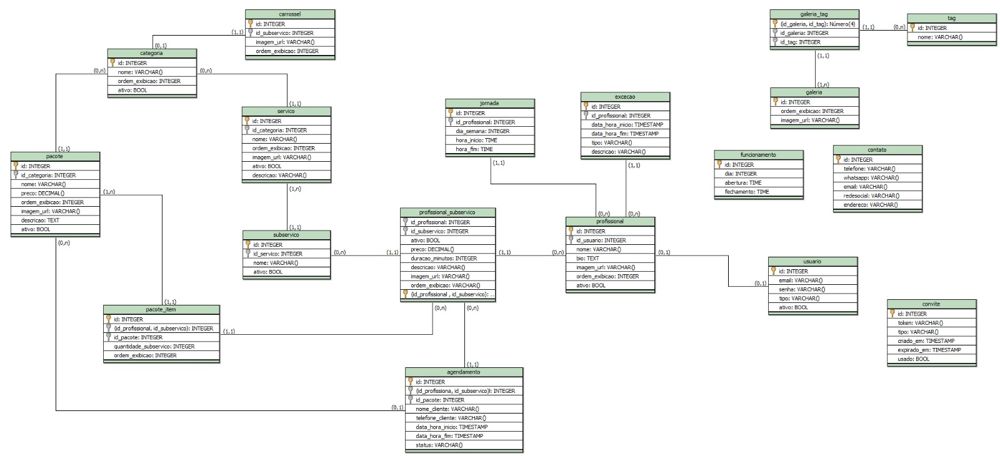

# Kenia Pinheiro Studio — API

Backend de um sistema de gestão para salão de beleza, desenvolvido em 
equipe como projeto de extensão da faculdade, com o objetivo de entregar 
uma aplicação real para a comunidade.

A API é construída em **Python + FastAPI**, com **PostgreSQL** isolado em 
container Docker, e serve um front-end em **Vue.js** desenvolvido em 
paralelo pela equipe.

---

## 📸 Preview

  
  

  <em>API em execução e documentação interativa (Swagger)</em>

  

  <em>Modelagem do banco de dados</em>

---

## 🎯 Sobre o projeto

O sistema foi pensado para atender as necessidades reais de um salão — 
gerenciamento de profissionais, serviços, agendamentos e uma área 
administrativa separada da área das profissionais.

A arquitetura do backend foi organizada em **camadas bem definidas**, 
para que cada parte do código tenha uma responsabilidade clara e o 
projeto consiga crescer sem virar bagunça:

- **Model** — comunicação com o banco (SQL puro)
- **Schema** — validação do formato dos dados que entram e saem
- **Service** — regras de negócio e decisões
- **Router** — recebimento das requisições e ligação com o service

Esse padrão foi adotado desde o início e serve de guia para todas as 
features do sistema, mantendo consistência conforme a equipe cresce.

---

## 🧩 O que já foi desenvolvido

A primeira feature implementada foi o **sistema de convites e cadastro**, 
que permite que um administrador convide profissionais para o sistema 
através de links temporários e seguros.

**Fluxo implementado:**

- Geração de convite com token aleatório (via `secrets`)
- Expiração automática em 24h
- Uso único — o convite é invalidado após o cadastro
- Validação completa do convite (existe? expirou? foi usado?)
- Cadastro de usuário com validação de senha forte
- Hash de senha com **bcrypt** (nunca salva senha em texto puro)
- Validação de email e formato dos dados com **Pydantic**

Esse fluxo envolveu as quatro camadas do backend, servindo como base 
sólida para as próximas features do sistema.

---

## 🗄️ Modelagem do banco de dados

O banco foi projetado para atender as regras de negócio do salão desde 
o início, considerando:

- Relacionamentos entre profissionais, serviços e subserviços
- Tabela intermediária `profissional_subservico` para permitir que cada 
  profissional defina seu próprio preço e duração por serviço
- Controle de jornada e exceções (folgas, férias, bloqueios)
- Agendamentos vinculados a profissional + subserviço
- Pacotes compostos por múltiplos itens
- Uso de `ativo` (booleano) em vez de exclusão, preservando histórico

O schema completo está em [`database/schema.sql`](database/schema.sql).

---

## 🎨 Contribuições além do backend

Além do desenvolvimento da API, também contribuí em outras frentes do 
projeto:

- **Front-end (Vue.js):** desenvolvi a **navbar** e o **footer** do site, 
  componentes presentes em todas as páginas. O restante das telas está 
  sendo desenvolvido pela equipe, e a integração com o backend será 
  feita após a conclusão das features principais da API.

- **Organização do projeto:** participei da definição do padrão de 
  estrutura em camadas que a equipe adotou, ajudando a manter o código 
  consistente e facilitar a leitura conforme novas features forem sendo 
  adicionadas.

- **Documentação para o time:** criei um **guia passo a passo** para 
  configurar o ambiente do projeto, cobrindo desde a criação do ambiente 
  virtual até a subida dos containers Docker e configuração das 
  variáveis de ambiente. Como a configuração inicial costuma ser uma das 
  partes mais trabalhosas para quem está começando, o guia permitiu que 
  os integrantes do time conseguissem rodar o projeto localmente sem 
  depender de ajuda externa — reduzindo dúvidas repetidas e agilizando 
  o onboarding de cada pessoa no repositório.

---

## 📌 Próximos passos

- Autenticação com login e JWT
- Middleware de permissão (ADMIN vs PROFISSIONAL)
- Features de agendamento, profissionais e serviços
- Área administrativa completa para personalização completa do site
- Integração com o front-end em Vue.js
